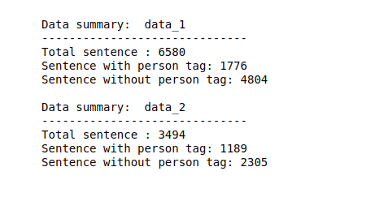
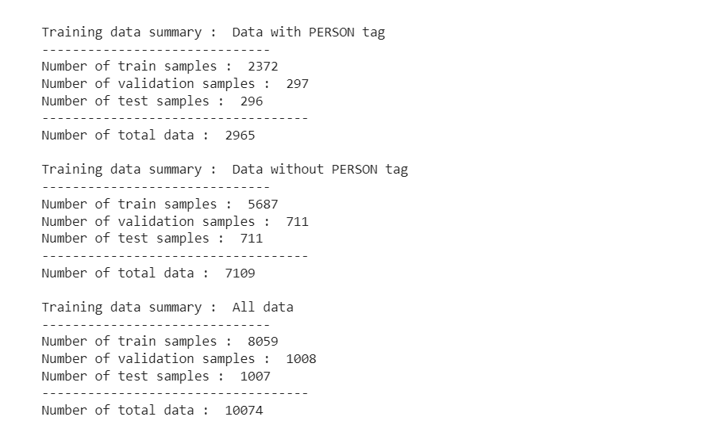
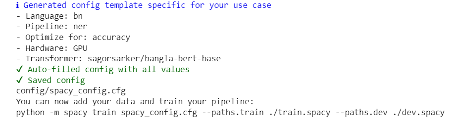
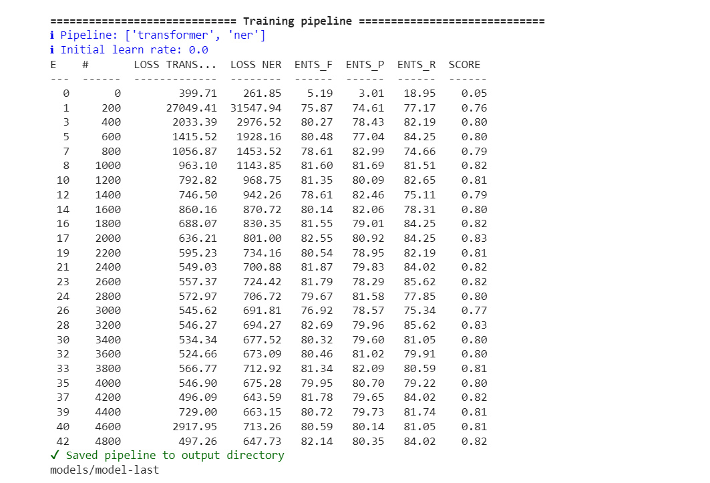
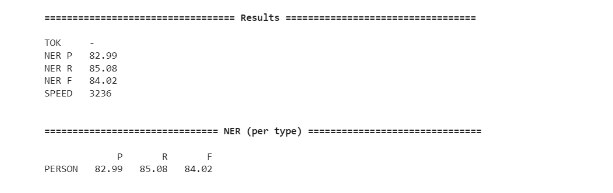
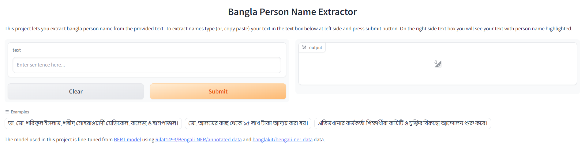
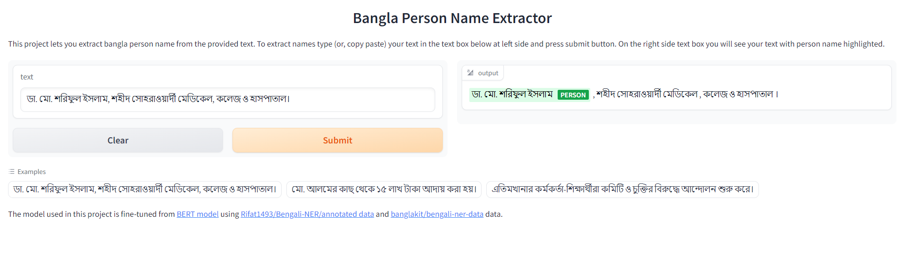
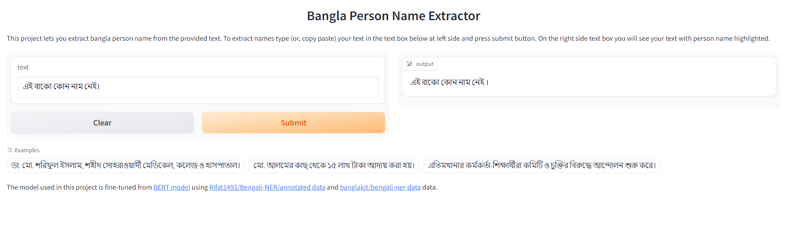

# Bangla Persosn-Name Extractor
This repository contains code for extracting `person-name` form bangla text.

# Environment Setup
We have used anaconda to setup environment. If you are using anaconda then you can setup a virtual environment using the `environment.yml` file provided. To do so run below command in the project directory
```bash
conda env create -f environment.yml
```
After the environment is created activate the environment using following command
```bash
conda activate spacy_ner
```
Or, if you are using pip you can install the dependencies by using [requirements.txt](./requirements.txt). Run below command to install dependencies using pip.
```bash
pip install -r requirements.txt
```

# Data Analysis and Preprocessing
## Analysis
We got two datasets.
1. [Rifat1493/Bengali-NER/annotated data](https://github.com/Rifat1493/Bengali-NER/tree/master/annotated%20data) (data_1), and
2. [banglakit/bengali-ner-data](https://raw.githubusercontent.com/banglakit/bengali-ner-data/master/main.jsonl) (data_2)

After looking through the data it is found that data_1 is in `IOB` notation and data_2 is in `BILUO` notation. So, we need to process the data to be in similar notation. We will use `BILUO` notation for our project as initial plan is to use `spacy`.

## Preprocessing
### Step 1:
To process the data, we first need to download them. A [function](./data_processing.py#L4) was written to save two dataset in two seperate files.
### Step 2:
Now we need to convert both the data into similar format. Data_1 is tokenized, but Data_2 is not. We will need a tokenizer for tokenizing data_2. We will modify [bert tokenizer](https://github.com/google-research/bert/blob/master/tokenization.py). We will convert both data into below format for processing further.
```py
[
    {
        "tokens": ["ইব্রাহীম", "ভালো", "কোডিং", "পারে", "না","।"],
        "tags": ["B-PER", "O", "O", "O", "O", "O"],
    },
]
```

N.B. (1): We found that some words in data_1 has no tag tag for it, so we will remove those tokens. Also some sentence have extra tags, we will remove those also. There are many more issues in the data i.e. there is a person name but it is tagged as `O`, same person name is tagged as `PERSON` in some sentence and tagged as `O` in other sentence, etc. We will ignore these as we have limited time for the submission.


After this we will convert `IOB` notation into `BILUO` notation and we will also remove all NER tags other than `Person` tags. We will changes all `*-PER` tag to `*-PERSON` tag for consistancy across data.


N.B. (2): After removing other tags than `Person` we have some sentences with `Person` and some sentences with `O` tags only (which actually means no tag). To prevent skewness is data we will make train, test, validation sets from those two categories seperately.

N.B. (3): The tokenizer we created from bert tokenizer treat all punctuations as token. Which leads to converting `মো.` --> `মো` and `.`, `ডা.` --> `ডা` and `.`, `৯.৭` --> `৯` and `.` and `৭`, `কো-অপারেটিভ` --> `কো` and `-` and `অপারেটিভ`, etc. This results into inconsistency in token lengths and tag lengths. We will modify the tokenizer to not tokenize on `.` character. But data_1 has `.` as a seperate token and `-` not seperated i.e. `মো.` --> `মো` and `.`, and `কো-অপারেটিভ` --> `কো-অপারেটিভ`. We will modify the processing steps for data_1 so that these cases match on both datasets. We will merge `মো` and `.` --> `মো.`, and split `কো-অপারেটিভ` --> `কো` and `-` and `অপারেটিভ` on data_1. We will also modify the tags accordingly.

With above processing we were able to retieve data with below numbers.


### Step 3:
We will merge sentences containing `PERSON` tag from both dataset (data_1 data_2) and split them into train, validation, and test set in (80%,10%,10%) ratio respectively.
We will merge sentences without `PERSON` tag from both dataset (data_1 data_2) and split them into train, validation, and test set in (80%,10%,10%) ratio respectively.
Now, we will merge both train data (with and without `PERSON` tag) into one and convert them to spacy data format (spacy binary data). We will do the same for validation and test set also.


# Model Training and Evaluation
We will fine-tune [BERT model](https://huggingface.co/csebuetnlp/banglabert) from [BUET CSE NLP group](https://huggingface.co/csebuetnlp) using spacy. We chose to fine-tune this model because this model has better test result, claimed by [BUET CSE NLP group](https://huggingface.co/csebuetnlp) and Spacy default bangla [model](https://huggingface.co/sagorsarker/bangla-bert-base) does not provide enough test result. We will train the model on free cloud GPU using [Google Colab](https://colab.research.google.com/). The notebook file has been provided which can be used for training. If you want to use teminal for training then you can follow below steps.

Step 1: At first we want to download and process data. For this you can run below command in the project directory on a environment activated terminal.
```bash
python -m preprocessing.raw_data_processing
```
This will download both the dataset and then clean them and store them in previously mentioned format.

Step 2: Then we want to split the data into train, validation, and test sets and convert them into Spacy binary format. To do this run the following command.
```bash
python -m preprocessing.train_data_processing
```
This will read the processed data in previous step and then split both data into train, validation, and test set for data that contains `PERSON` tag and data that does not contain `PERSON` tag seperately. After spliting it will merge similar splits i.e. train, test etc of data with `PERSON` tag and without `PERSON` tag. Finally it will store the data in Spacy binary format.

N.B. All the paths and directories are defined in [config.py](./config/config.py) file.

Step 3: Now, we will generate spacy training config. Run below command to generate the config file.
```bash
python -m spacy init config config/spacy_config.cfg --lang bn --pipeline ner --optimize accuracy --gpu
```
This will save the training config as `config.cfg` in [config](./config/) directory.


We need to modify the config. We will open it in any text editor and change the following
1. In the [components.transformer.model] section we will change `name` from `sagorsarker/bangla-bert-base` to `csebuetnlp/banglabert`.
2. In the [training] section we will set `max_epochs` to 50.

After the changes we will save the file.

Step 4: At this step we will train the model. For training we use below command.
```bash
python -m spacy train config/spacy_config.cfg --output models --gpu-id 0 --paths.train dataset/train.spacy --paths.dev dataset/valid.spacy
```
This will start the training and save the weights in `models` directory. Spacy saves two models- `model-best` and `model-last`.


Step 5: Now we will evaluate the model on `test` data. We will use `model-best` for evaluaion. To evaluate below command is used.
```bash
python -m spacy benchmark accuracy models/model-best dataset/test.spacy --gpu-id 0
```
Below is the evaluation result from last model


# Prediction on User Input
To take predictions on user input we can use the [bangla_person_name_extractor.py](./bangla_person_name_extractor.py) script. But first we need a model for this task. We can either [train](#model-training-and-evaluation) a new model and use that, or we can use a pretrained model. If we want to use pretrained model then we would want to download it first. We can download by running below command. It will download a model trained for this project from [google drive](https://drive.google.com/drive/folders/1zJfAVSItJVkHt-ttGgB383VrXeBasAHX?usp=drive_link).
```bash
python -m utils.downloader
```
After training/downloading model we can take prediction with the model in following ways
1. Using below bash command and passing the text as argument, it will print the ouutput in terminal.
```bash
python -m bangla_person_name_extractor -i "মো. আলমের কাছ থেকে ১৫ লাখ টাকা আদায় করা হয়।"
```
2. Using below bash command and passing the text as argument and a ouput json path, it will write the output in the json file path passed as argument.
```bash
python -m bangla_person_name_extractor -i "মো. আলমের কাছ থেকে ১৫ লাখ টাকা আদায় করা হয়।" -o out.json
```
3. Importing the file in another python script
```python
from bangla_person_name_extractor import BanglaPersorNer

# create an object of BanglaPersorNer
bp_ner = BanglaPersorNer()
# text to extract person name from
text = "মো. আলমের কাছ থেকে ১৫ লাখ টাকা আদায় করা হয়।"
# extract person names
res =  bp_ner.extract_person_name(text)
# print the result
print(res)
```
4. If none of the above feels easy to use then you can use the gradio interface. To use gradio interface run below command
```bash
python app.py
```
Now, open browser and go to http://127.0.0.1:7860/. It will open a page like below image. 

You can write your text on the left text box, then press submit and you will be able to see output on the right text box.

